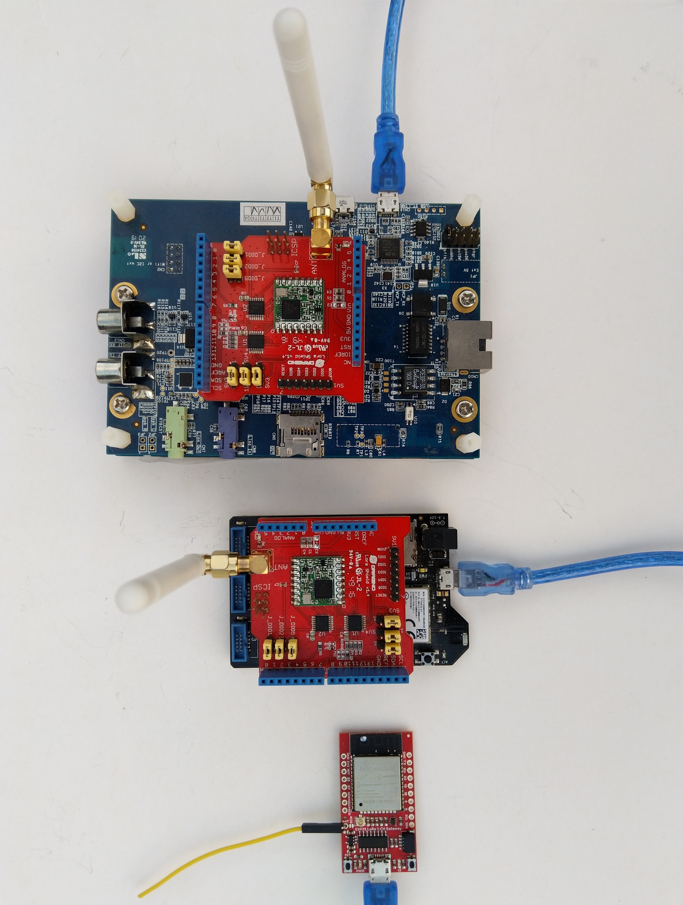

# SX127X-NetNF
A C# library for [LoRa](https://lora-alliance.org/) connectivity with Semtech [SX127X](https://www.semtech.com/products/wireless-rf/lora-transceivers/SX1276)/HopeRF [RFM9X](http://www.hoperf.com/rf_transceiver/lora/RFM95W.html) equipped [.NET nanoFramework](https://www.nanoframework.net/) powered devices.

This library is based on my [RFM9XLoRa-NetNF](https://github.com/KiwiBryn/RFM9XLoRa-NetNF) with improvements/bug fixes from my [SX127X-NetCore](https://github.com/KiwiBryn/SX127X-NetCore) library.

The repo has the source code for the series of blog posts written as I built this library

01. [Registers](https://blog.devmobile.co.nz/2022/03/08/net-nanoframework-sx127x-lora-library-registers/)
02. [Read and Write](https://blog.devmobile.co.nz/2022/03/09/net-nanoframework-sx127x-lora-library-read-amp-write/)
03. [Transmit and Receive Basic](https://blog.devmobile.co.nz/2022/03/11/net-nanoframework-sx127x-lora-library-basic-receive-transmit/)
04. [Now with added Interrupts](https://blog.devmobile.co.nz/2022/03/14/net-nanoframework-sx127x-lora-library-with-interrupts/)
05. [Playing nice with others](https://blog.devmobile.co.nz/2022/03/18/net-nanoframework-sx127x-lora-library-playing-nice-with-others/)
06. [It's all abount timing](https://blog.devmobile.co.nz/2022/03/22/net-nanoframework-sx127x-lora-library-its-all-about-timing/)
07. [Can't hear you-RegLna & RegLnaGain](https://blog.devmobile.co.nz/2022/04/01/net-sx127x-lora-library-reglna-lnagain/)
08. [Can you hear me-RegPaConfig & RegPaDac](https://blog.devmobile.co.nz/2022/04/16/net-sx127x-lora-library-regpaconfig-regpadac/)
09. [Dio0,Dio1,Dio2,Dio3,Dio4,Dio5](https://blog.devmobile.co.nz/2022/04/26/net-sx127x-lora-library-dio0dio1dio2dio3dio4dio5/)
10. [RegPaConfig RegPaDac The never ending story](https://blog.devmobile.co.nz/2022/05/01/net-sx127x-lora-library-regpaconfig-regpadac-the-never-ending-story/)
11. [The Big Refactoring](https://blog.devmobile.co.nz/2022/05/08/net-sx127x-lora-library-refactoring/)
12. [Pain of Regression Testing](https://blog.devmobile.co.nz/2022/05/09/net-sx127x-lora-library-regression-testing/)

There are also a parallel development projects for [.Net](https://github.com/KiwiBryn/SX127XLoRa-Net), and [GHI ELectronics](https://ghielectronics.com/) [TinyCLR](https://github.com/KiwiBryn/RFM9XLoRa-TinyCLR)

My test rig consisted of
* [STM32F796I Discovery](https://www.st.com/en/evaluation-tools/32f769idiscovery.html) from [ST Micro electronics](https://www.st.com)
* [Dragino Shield](https://www.dragino.com/products/lora/item/102-lora-shield.html) from [Dragino Technology](http://www.dragino.com)
* [Netduino 3 Wifi](https://developer.wildernesslabs.co/Netduino/About/) from [Wilderness Labs](https://www.wildernesslabs.co/)
* [Sparkfun LoRa Gateway - 1-Channel (ESP32)](https://www.sparkfun.com/products/15006) from [Sparkfun](https://www.sparkfun.com/)

